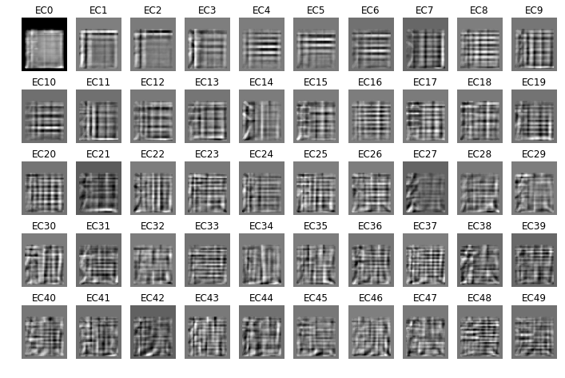
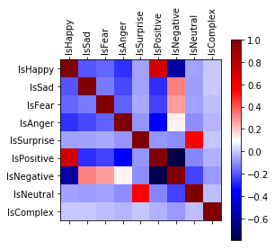
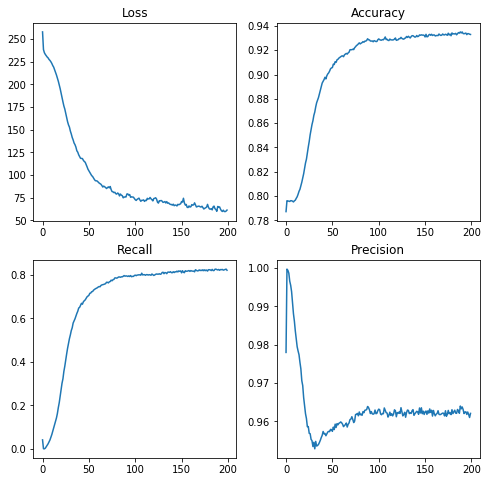
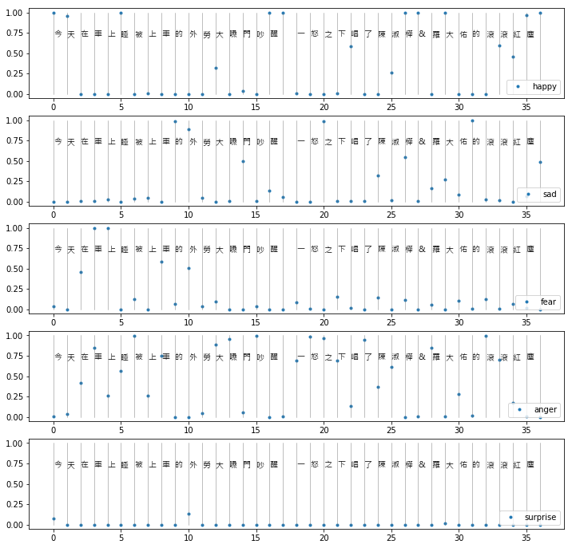

# 20190522

## Goal
How eigen-characters(ECs), as form descriptors/cues, in emotion words, related to word meanings, as annotated against basic emotion categories.

## Eigen-characters

### EC50
First 50 ECs are shown as follows:



### the most loaded characters in each EC (Following are first 20 ECs)

```
           Positive           |          Negative          
------------------------------------------------------------
                              ---                              
 0 轟 竇 鷹 驀 鑿 囂 攫 鱸 曇 靂 | 一 卜 二 丫 十 丁 入 人 了 小
                              ---                              
 1 圄 鬩 閘 圓 閩 回 圖 圃 囗 閒 | 值 椿 捧 撞 捷 樁 掩 搐 揍 憧
                              ---                              
 2 哼 廊 噴 唷 暄 庾 嗑 嘩 棘 瞋 | 摳 揭 擂 揠 捍 提 倡 福 樞 偈
                              ---                              
 3 樵 棕 粽 柚 鋪 怕 棺 拍 指 捕 | 原 厝 盾 唐 屈 尾 屐 厘 展 屎
                              ---                              
 4 善 嗐 惶 蝗 幔 模 蟳 羨 這 糢 | 事 辜 毒 喜 曹 壼 肩 單 黃 重
                              ---                              
 5 青 亭 晴 衰 夢 奏 嗜 冑 障 春 | 姜 美 兼 愚 晏 烏 畬 當 胃 言
                              ---                              
 6 晨 隻 濡 叢 儒 掌 暑 貧 砦 需 | 嘉 碁 窘 幕 墓 倉 寧 管 氟 專
                              ---                              
 7 朋 測 洌 捫 捌 伺 朗 汩 倒 側 | 柑 匾 貫 書 景 袒 張 誓 熹 璽
                              ---                              
 8 襄 書 農 梟 膿 嘍 嚏 責 漬 婁 | 義 壘 議 鎳 霍 奠 尊 儀 儷 屯
                              ---                              
 9 哩 阻 嘔 道 豎 呃 瞳 曜 哇 喳 | 帥 細 癇 鈾 訕 訓 絀 袖 聒 蝕
                              ---                              
------------------------------------------------------------
                              ---                              
10 華 讓 吳 榮 乒 案 貲 乓 扈 章 | 芸 膊 者 芋 岸 鞏 妾 腌 夸 堂
                              ---                              
11 蛀 畦 趾 肚 蚯 蛇 峙 粒 毗 蛭 | 諫 睏 語 譁 呷 嶼 誤 咱 眼 胴
                              ---                              
12 鋰 荳 狸 埋 程 錘 誦 理 連 苞 | 告 自 吉 岩 輩 杏 雖 宕 羔 偌
                              ---                              
13 酉 錯 茜 鉛 鈕 皿 西 詣 佰 鉻 | 剝 判 滬 剃 腫 妺 刑 刊 盹 碉
                              ---                              
14 炬 汛 啊 湄 治 啾 喇 走 溝 漬 | 貝 飪 兒 釦 蘋 聰 扎 雙 捱 批
                              ---                              
15 詐 謔 詮 誅 託 訪 訣 註 鍾 誌 | 罕 吼 哦 番 耳 甲 宗 睨 室 呆
                              ---                              
16 蔓 壽 疇 晝 蘭 瀆 濤 畫 裏 導 | 暈 量 嘗 盧 賞 霉 嚐 震 讒 靈
                              ---                              
17 讀 鑄 誠 謾 誡 說 詼 諺 試 護 | 面 騎 驊 肆 暈 陣 畸 劈 翼 畔
                              ---                              
18 課 評 喁 芽 輊 瑪 譎 戟 琛 暉 | 跪 脆 腓 脫 匡 桅 胳 脈 臉 剛
                              ---                              
19 山 出 屆 囪 追 槽 引 笛 揩 呂 | 篝 菁 賢 霄 灣 覽 賞 霾 臺 摹
                              ---                              
```

---

## Affective Lexicon (From Lu, 2015)

Manual annotated 10,032 lemmas on five emotion categories (Ekman's basic emotion):
Happy(1), Sad(2), Fear(3), Anger(4), Surprise(5)

Frequency distribution is as follows:
```
4        3362
1        2618
2        2234
3        1611
5         322
3,4        61
2,4        54
2,3        53
2,3,4       4
3,5         4
1,2         3
2,5         3
1,5         2
0           2
1,3         1
4,5         1
```

Each lemma may have been assigned to more than one category, so they are recoded into a multinomial distribution:

| lemma    |   IsHappy |   IsSad |   IsFear |   IsAnger |   IsSurprise |   IsPositive |   IsNegative |   IsNeutral |   IsComplex |
|:---------|----------:|--------:|---------:|----------:|-------------:|-------------:|-------------:|------------:|------------:|
| 驚嚇     |         0 |       0 |        1 |         0 |            0 |            0 |            1 |           0 |           0 |
| 鬱鬱寡歡 |         0 |       1 |        0 |         0 |            0 |            0 |            1 |           0 |           0 |
| 鬱鬱不樂 |         0 |       1 |        0 |         0 |            0 |            0 |            1 |           0 |           0 |
| 鬱結     |         0 |       1 |        0 |         0 |            0 |            0 |            1 |           0 |           0 |
| 鬱悶     |         0 |       1 |        0 |         0 |            0 |            0 |            1 |           0 |           0 |

Frequency distribution of the resulting multinomial categories:

```
IsHappy       2469
IsSad         2274
IsFear        1727
IsAnger       3438
IsSurprise     309
IsPositive    4037
IsNegative    8811
IsNeutral      449
IsComplex       49
```

And their correlations:



## NN-Model of ECs and emotion categories

### Model specification

```
AffectiveEcModel(
  (rnn): GRU(50, 100, batch_first=True)
  (h2o): Linear(in_features=100, out_features=5, bias=True)
)
```

### Training phase diagnostics

> why not testing phase?



### Some ad-hoc testing cases

```
藍瘦香菇, in train: False => ['Happy', 'Sad']
欣喜若狂, in train: True => ['Happy']
快樂, in train: True => ['Happy']
享樂, in train: True => ['Happy']
享受, in train: True => ['Happy']
盛怒, in train: True => ['Anger']
盛恕, in train: False => ['Anger']
爆怒, in train: False => ['Anger']
唬爛, in train: True => ['Anger']
畫唬爛, in train: False => ['Sad']
流言, in train: False => []
中立, in train: False => ['Anger']
台北, in train: False => ['Happy']
台中, in train: False => ['Happy']
高雄, in train: False => ['Happy']
八卦, in train: True => ['Anger']
```

### A running text example



----

## Related notebooks

1. Building eigen-characters space [ipynb](https://nbviewer.jupyter.org/github/seantyh/Fusiform/blob/master/40_Interface/eigen-character.ipynb)
2. EDA on ec-space [ipynb](https://nbviewer.jupyter.org/github/seantyh/Fusiform/blob/master/40_Interface/ec_space.ipynb)
3. Recoding and EDA on affective lexicon [ipynb](https://nbviewer.jupyter.org/github/seantyh/Fusiform/blob/master/40_Interface/19052201-afflex.ipynb)
4. Model building on ECs and affective lexicon [ipynb](https://nbviewer.jupyter.org/github/seantyh/Fusiform/blob/master/40_Interface/19052202-affectve-EC.ipynb)